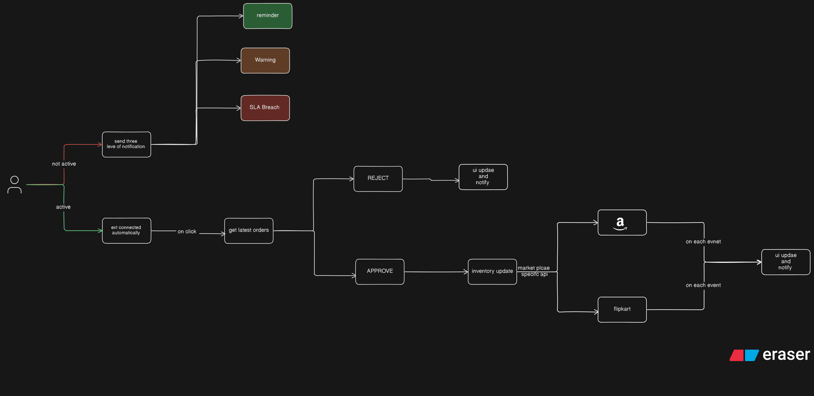
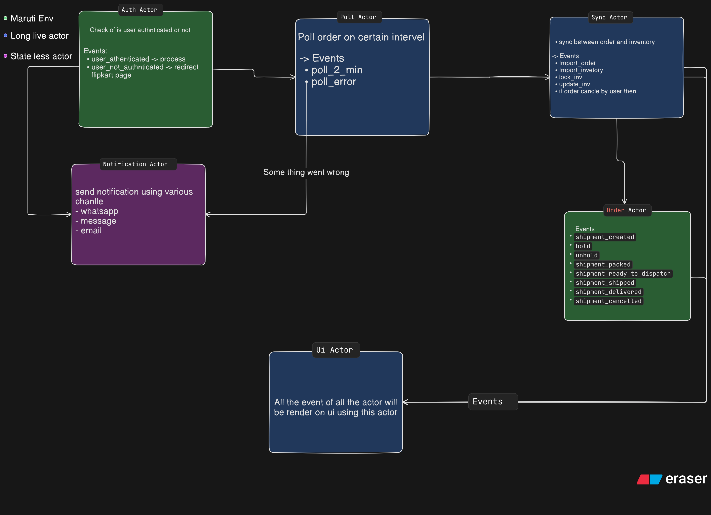

## Order Processing

### Auth Flow

**Case 1: User is not active**
Send a three-level escalation notification:
  1. Reminder
  2. Warning
  3. Breach of SLA

**Case 2: User is active**
Open the browser flow:
  1. Open the DeepEcom order processing dashboard. This connects to the browser extension.
  2. If the user is not logged in, redirect them to the login page.

While the user is active, use GetStream (acting as a bridge/notification layer) to signal that they're active.
  - **How:** Poll the user's browser session at regular intervals to detect activity.

### Inventory Sync

- **Problem:** Inventory needs to stay in sync across marketplaces.
- **Solution:** Fetch inventory data from each marketplace, then update it in our UI.
- **Note:** This is tightly coupled with order fetching — the two are interdependent and should be considered together.

### Product Mapping

- **Problem:** The same product is listed on different marketplaces, but each marketplace assigns it a different SKU.
- **Solution:** Create a unified mapping between listings, using the product description as the matching key.

## Major Trade-off

Real-time order processing depends on the user being online with an active Chrome session. If the user is offline or their Chrome session is inactive, real-time processing isn't possible.

| Event Type (`eventType`)     | When It Fires                                                                  | API Responsible                                                                                                                                                                        | What You Should Do                                                                                 |
| ---------------------------- | ------------------------------------------------------------------------------ | -------------------------------------------------------------------------------------------------------------------------------------------------------------------------------------- | -------------------------------------------------------------------------------------------------- |
| `shipment_created`           | New order placed; shipment enters `APPROVED` state                             | **Pushed by:** Flipkart Notification Service **Poll fallback:** `GET /v3/shipments/{shipmentIds}` or `POST /v3/shipments/filter`                                                    | Start SLA timer. Check `dispatchAfterDate` and `hold` status before acting.                        |
| `hold`                       | Flipkart puts shipment on hold for verification                                | **Pushed by:** Flipkart Notification Service **Poll fallback:** `GET /v3/shipments/{shipmentIds}`                                                                                   | Pause processing. Wait for `unhold`. Do not call label/dispatch APIs.                              |
| `unhold`                     | Flipkart removes hold; shipment is now actionable                              | **Pushed by:** Flipkart Notification Service **Poll fallback:** `GET /v3/shipments/{shipmentIds}`                                                                                   | Resume processing. Verify current time is after `dispatchAfterDate`.                               |
| `shipment_packed`            | Labels & invoices generated; state moves from `PACKING_IN_PROGRESS` → `PACKED` | **Triggered by seller:** `POST /v3/shipments/labels` (async call) **Pushed by:** Flipkart Notification Service when ready **Download:** `GET /v3/shipments/{shipmentIds}/labels` | Download label PDF + invoice. Proceed to pack the physical item.                                   |
| `shipment_ready_to_dispatch` | Seller marks shipment as RTD; state → `READY_TO_DISPATCH`                      | **Triggered by seller:** `POST /v3/shipments/dispatch` **Pushed by:** Flipkart Notification Service                                                                                 | Update internal status. Prepare for handover. Download manifest via `POST /v3/shipments/manifest`. |
| `shipment_shipped`           | Logistics partner picks up the shipment                                        | **Pushed by:** Flipkart Notification Service **Self-ship trigger:** `POST /v3/shipments/selfShip/dispatch` **Poll fallback:** `GET /v3/shipments/{shipmentIds}`                  | Update tracking status. Notify customer if applicable.                                             |
| `shipment_delivered`         | Logistics partner delivers to customer                                         | **Pushed by:** Flipkart Notification Service **Poll fallback:** `GET /v3/shipments/{shipmentIds}`                                                                                   | Close order. Trigger post-delivery workflows (feedback, settlements).                              |
| `shipment_cancelled`         | Order cancelled before shipping (by seller, buyer, or marketplace)             | **Triggered by seller:** `POST /v3/shipments/cancel` **Pushed by:** Flipkart Notification Service (if cancelled by others) **Poll fallback:** `GET /v3/shipments/{shipmentIds}`  | Reconcile inventory back to available pool. Stop any in-progress packing.                          |

### Actor Mapping 
